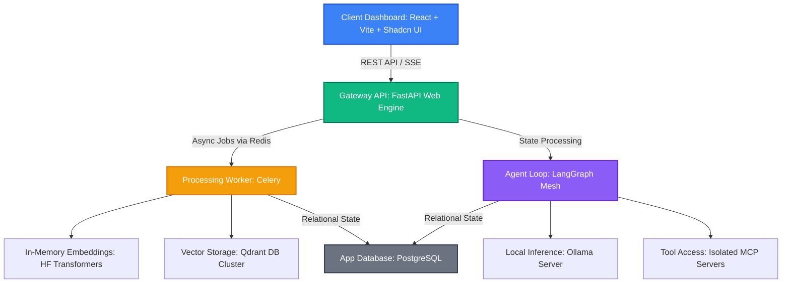

# ComplianceIntel AI — System Architecture Specification

ComplianceIntel AI is a multi-tenant, production-grade B2B SaaS platform engineered to automate corporate compliance, due diligence auditing, and regulatory risk assessments. The system runs entirely on a localized AI infrastructure, removing public API costs and guaranteeing absolute enterprise data privacy.

---

## 1. Core Architectural Pillars

*   **Multi-Tenant Privacy:** Strict data isolation across PostgreSQL and Qdrant clusters using tenant organization indexing (`organization_id`).
*   **Decoupled Async Workloads:** High-performance FastAPI routing handles instantaneous web requests, while heavy document processing is delegated out-of-process to Celery workers.
*   **Hybrid Local AI Execution:**
    *   *Generative AI Layer:* Ollama daemon hosted locally running quantized 8B/14B models via an OpenAI-compatible API loop for agent reasoning and tool usage.
    *   *Embedding & RAG Layer:* Native Hugging Face sentence-transformers loaded directly into Python memory for ultra-fast, in-process mathematical text vectorization.
*   **Stateful Agent Mesh:** Complex compliance checking is governed by a cyclic LangGraph state machine incorporating self-correction and validation feedback loops.
*   **Secure Infrastructure Auditing:** Agent interactions with live data models operate over the Model Context Protocol (MCP) using isolated JSON-RPC stdio channels.

---

## 2. Global System Data Flow



### Text Data Flow Map
```text
                      [ Client Dashboard: React + Vite + Shadcn UI ]
                                            |
                         (REST API / Server-Sent Events)
                                            v
                        [ Gateway API: FastAPI Web Engine ]
                                            |
                     +----------------------+----------------------+
                     |                                             |
        (Async Jobs via Redis)                            (State Processing)
                     v                                             v
       [ Processing Worker: Celery ]                 [ Agent Loop: LangGraph Mesh ]
                     |                                             |
       +-------------+-------------+                 +-------------+-------------+
       |                           |                 |                           |
(HF Transformers)          (Vector Storage)   (Local Inference)           (Tool Access)
       v                           v                 v                           v
[ In-Memory Embeddings ]   [ Qdrant DB Cluster ]  [ Ollama Server ]       [ Isolated MCP Servers ]
       |                                             |                           |
       +--------------------+------------------------+---------------------------+
                            |
                     (Relational State)
                            v
               [ App Database: PostgreSQL ]
```

---

## 3. High-Value Pipelines

### A. Async Document Ingestion Pipeline (The RAG Intake)
1. **Upload:** Client uploads a compliance text resource (PDF/Excel) through the React workspace portal.
2. **Ingest Gateway:** FastAPI validates tenant access, generates an MD5 file checksum to prevent duplicate processing, writes metadata to PostgreSQL, and schedules a Celery ingestion task.
3. **Chunking & Vectorization:** The background Celery worker extracts text, executes recursive character text splitting (1000 chunk size / 200 overlap), and feeds segments into the native Hugging Face `BAAI/bge-large-en-v1.5` transformer model inside local memory.
4. **Storage:** Generated vector embeddings are upserted into the Qdrant cluster tagged explicitly with the owner's `organization_id`.

### B. Agentic Reasoning & Audit Pipeline (The Self-Correcting Loop)
1. **Initiate:** The user posts a compliance auditing query through the dashboard.
2. **Graph Boot:** FastAPI initializes a LangGraph worker state initialized with tenant context boundaries.
3. **Retrieval Node:** LangGraph invokes the custom Hybrid Search engine, querying Qdrant using the local embedding model and running structural context hits through a local Hugging Face Cross-Encoder model (`ms-marco-MiniLM-L-6-v2`) for absolute precision re-ranking.
4. **Reasoning Node:** The top contexts are passed to the Ollama execution daemon (`llama3.1:8b`). The model evaluates policy alignment and accesses underlying infrastructure frameworks via MCP tools.
5. **Validation Loop:** The output hits the Validator Node. If the agent output contradicts the verified document inputs, the graph increments the retry counter, modifies the prompt layout, and routes back to the planning state.
6. **Streaming delivery:** As the final answer nodes validate execution, token-by-token outputs stream down an asynchronous Server-Sent Events (SSE) gateway directly into the React dashboard.

---

## 4. Repository Monorepo Topography

```text
compliance-intel/
├── backend/                   # FastAPI Application Root
│   ├── src/
│   │   ├── agents/           # LangGraph State Machine, Nodes, and Routers
│   │   ├── core/             # Database Configs, Security Middleware, AI Clients
│   │   ├── routers/          # API Endpoint Controllers (Auth, Ingestion, Streams)
│   │   └── services/         # Advanced RAG Services, Document Parsers
│   ├── requirements.txt      # Python Dependencies (fastapi, langgraph, qdrant-client)
│   └── alembic.ini           # Relational Database Migration Registry
├── frontend/                  # React Single Page Application Root
│   ├── src/
│   │   ├── components/       # Shadcn UI Design Systems & Chat Windows
│   │   ├── hooks/            # useComplianceStream Hook (SSE Network Managers)
│   │   └── App.tsx           # Dashboard Master Container Layout
│   ├── vite.config.ts        # Tailwind v4 Compiler Configuration & Path Aliases
│   └── package.json          # Node Toolchains Configured for pnpm Workspaces
├── mcp-servers/               # Isolated Infrastructure Tools Core
│   └── db_inspector.py       # Custom Stdio JSON-RPC Database Auditing Engine
└── docker-compose.yml        # Multi-Node Local Architecture Orchestrator
```

---

## 5. Local Infrastructure & Environment Setup

To run this platform locally, follow the steps below:

### Prerequisites
*   Docker & Docker Compose
*   Node.js v20+ & `pnpm`
*   Python 3.11+
*   Local Ollama daemon running (`ollama serve`) and the models pulled:
    ```bash
    ollama pull llama3.1:8b
    ```

### Services Setup (Docker Compose)
Spins up PostgreSQL, Redis, and Qdrant DB:
```bash
docker-compose up -d
```

### Backend Setup
1. Navigate to the backend directory and set up a virtual environment:
   ```bash
   cd backend
   python -m venv venv
   source venv/bin/activate
   ```
2. Install dependencies:
   ```bash
   pip install -r requirements.txt
   ```
3. Run Alembic database migrations:
   ```bash
   alembic upgrade head
   ```
4. Start the FastAPI backend server:
   ```bash
   uvicorn src.main:app --reload
   ```

### Frontend Setup
1. Navigate to the frontend directory:
   ```bash
   cd frontend
   ```
2. Install dependencies using `pnpm`:
   ```bash
   pnpm install
   ```
3. Start the Vite React development server:
   ```bash
   pnpm run dev
   ```

The dashboard will be live at `http://localhost:5173`.
